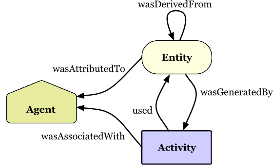
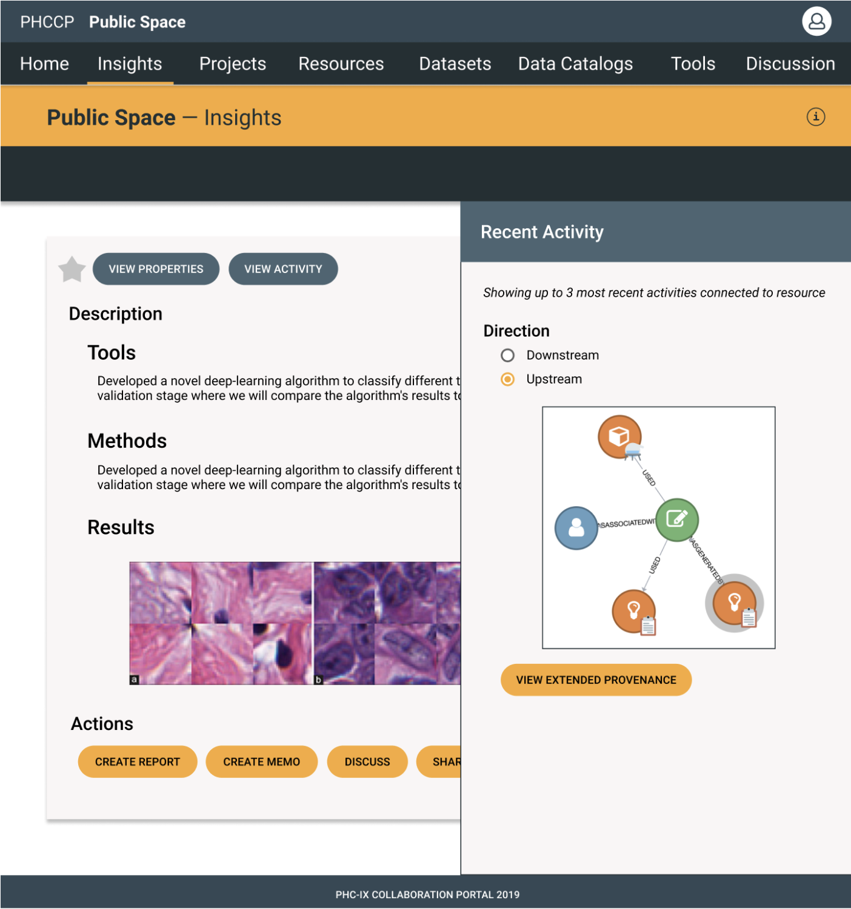
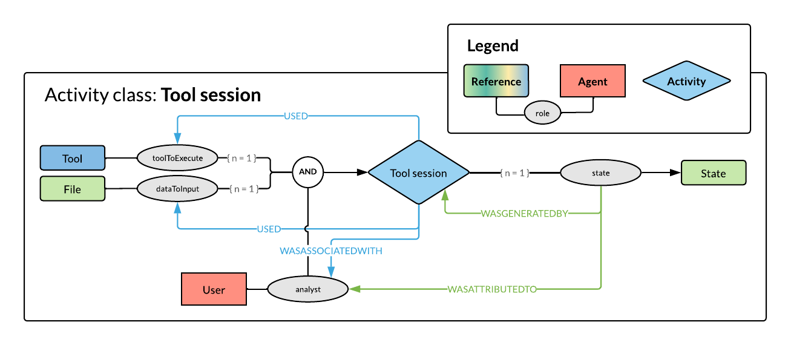
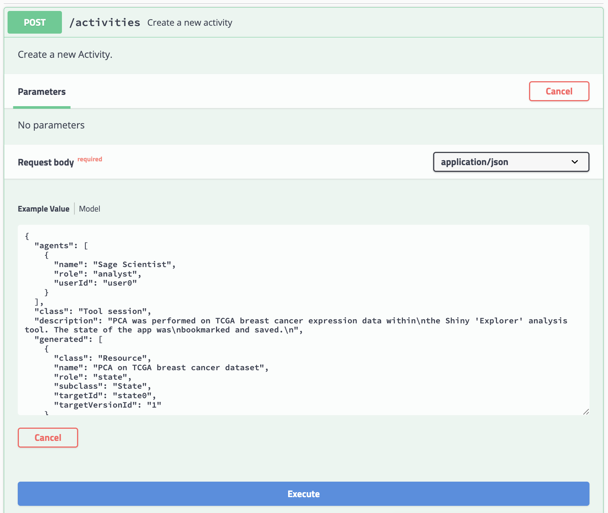
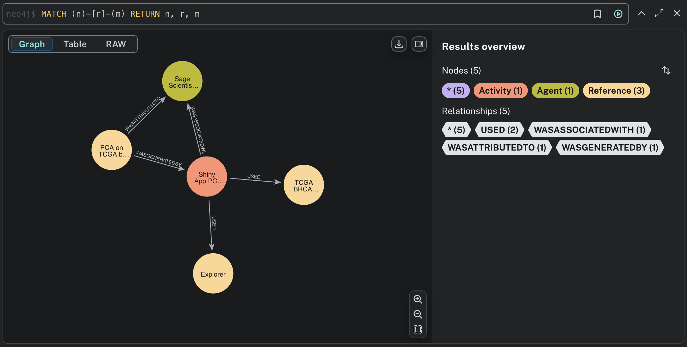

# Provenance (PROV) Service
<sup>James Eddy | 2025-07-16</sup>

This project provides a lightweight implementation of a RESTful provenance service with a graph database backend. The API is modeled loosely on the [Activity Services](https://rest-docs.synapse.org/rest/index.html#org.sagebionetworks.repo.web.controller.ActivityController) included in the [Synapse platform](https://www.synapse.org/) and provenance records are based on the [W3C PROV standard](https://www.w3.org/TR/prov-overview/).

## Preface

I decided to unearth an old project from my time at [Sage Bionetworks](https://sagebionetworks.org/). This turned into a more complicated task than expected.

Initially, I wanted to overhaul the dependency management to use [`uv`](https://github.com/astral-sh/uv) and migrate to a newer version of Python. After some trial and error—and some freshly generated code from the [OpenAPI](https://www.openapis.org/) specification (see **Implementation** details below)—my Python environment seemed to be working. As I turned my attention to Docker to provide a local installation of Neo4j, I discovered that the image I used several years ago is no longer compatible with my laptop architecture (Apple silicon). Finally, after getting those pieces working and attempting to run tests, I learned that a core library, the `py2neo` package, [reached end-of-life in 2023](https://neo4j.com/blog/developer/py2neo-end-migration-guide/). 

This last realization proved to be a particularly tricky: the suggested replacement library, `NeoModel`, uses a fairly different API than `py2neo` (more on this below) and would have required more extensive refactoring. As a workaround, I attempted to create a lightweight shim over the `neo4j` driver package to loosely replicate the `py2neo` functionality I needed.

The service runs, and tests are passing, but there are a number of limitations with my current solution:

> [!CAUTION]
> * The `mock` subpackage, which was developed by a collaborator, relied heavily on `py2neo` functionality to populate a representative (simulated) provenance graph with example activities. The "shim" solution did not fully address deprecated functionality in this subpackage, and more extensive updates would be needed—migrating to some combination of `neo4j` and `neomodel`—to ensure accurate and reliable behavior.
> * While the mocking functionality shouldn’t impact other parts of the codebase, it's used as part of the [test suite](../src/prov_service/test/), and might skew some test results.
> * Test coverage is relatively limited, focused on absolutely essential things needed for the service to run. More basic functionality—and significantly more edge cases—should be covered by unit tests.
> * As mentioned in the demo below, the migration from `py2neo` to `neo4j` has resulted in some dysfunction in the internal graph controllers. These should be refactored and tested accordingly.
> * I almost certainly haven't fully understood how `uv` should be used for dependency management and package development. I've been able to get things working in a couple local environments, but need to review more documentation and best practices to ensure this package is portable and easy to install.
> * The whole codebase (especially code that I’ve written) would benefit from linting and better in-line docs (e.g., docstrings and comments).


## Why provenance?

As an advocate for open science and reproducibility, I’ve long been enthusiastic about provenance as a framework for tracing the history of data and other research artifacts.

_**What is provenance?**_

> _"A representation of the entities, people and processes involved in producing a piece of data or thing in the world"_<sup>1</sup>

<sup>1</sup>https://www.w3.org/TR/prov-primer/

The diagram below provides a basic, but fairly comprehensive overview of the PROV structure (data model):



Provenance is a particularly useful concept for applications such as bioinformatics workflows/pipelines, where numerous computational steps are executed to transform a "raw" dataset into downstream results. For a nice perspective on how to capture and represent this type of provenance, I like [these slides](http://slides.com/soilandreyes/2018-01-15-interoperable-provenance#/) from Stian Soiland-Reyes. While Stian's presentation focused more on how provenance could be implemented with a "standard" framework such as the [Common Workflow Language (CWL)](https://www.commonwl.org/), there is evident interest in more modern ecosystems as well, as seen by the [Nextflow `nf-prov` plugin](https://github.com/nextflow-io/nf-prov).
 
While not my primary focus here, I also think provenance has great potential for capturing attribution/credit in biomedical research, as I [presented](bit.ly/attribution-ro19) a while ago.


## History

This package was originally developed in conjunction with a frontend application (see [`activity`](https://github.com/Sage-Bionetworks/sagebio-collaboration-portal/tree/develop/client/components/activity) and [`provenance`](https://github.com/Sage-Bionetworks/sagebio-collaboration-portal/tree/develop/client/components/provenance) Angular components), which allowed users to capture and explore provenance for research activities within a UI-based platform.



While not strictly enforced in this package, I believe a well-defined data model is benefical for broader capture of provenance. From my experience at SageBio, I inferred that the lack of more widespread provenance description, in spite of available tooling (and overlooking some very clear limitations in said tooling...), was potentially due to the open-ended nature of PROV as a data model. In other words, providing discrete options (for classifying activities, references, and agents) that a user could select in a form-like interface might facilitate increased recording of provenance.

For example, this diagram depicts a **"Tool session"** as a specific type of provenance `PROV:Activity`, with relationships to specific types of `PROV:Entity` and `PROV:Agent` classes.




## Implementation

This is an OpenAPI-enabled (and documented) Flask server. The app uses the [**Connexion**](https://github.com/zalando/connexion) library with Flask to connect the underlying API specification to server routes and operations. The `py2neo` driver library for Python _**was**_ used to manage operations between RESTful API requests/responses and a Neo4j database.

> [!INFO]
> more of a full fledged ORM than a driver with some ORM-like features

This server was originally generated by the OpenAPI Generator project. Starting with the Synapse Activity API specification represented in a `swagger.yaml` file, the contents of this repo were originally generated with the following command:

```shell
npx openapi-generator generate -i swagger.yaml -g python-flask -DpackageName=synprov -o prov-service/
```

> [!NOTE]
> I designed this package with parts of the API codebase intended to be auto-generated repeatedly (corresponding to any changes in the API spec) as [part of the CI/CD process](https://github.com/Sage-Bionetworks/prov-service/blob/develop/.build/codegen.sh). Revisiting the repo after several years, I recognized some downsides of this approach in the absence of regular maintenance. Specifically, changes in dependencies and syntax—especially when upgrading Python by several versions—have rendered old pipelines and templates defunct. For the sake of the current update, I've taken a more one-off approach to generating certain pieces of the codebase.

I used a similar command to generate new code, based on the latest version of the OpenAPI spec, and integrated this code into the package source (under [`src/prov_service/`](../src/prov_service/)) as outlined below:


### API spec:

+ [`openapi/openapi.yaml`](../src/prov_service/openapi/openapi.yaml): the full OpenAPI specification, with operations and models defined primarily for a single endpoint/path named `activities` 

### Subpackages:

+ [`controllers/`](../src/prov_service/controllers/): mostly auto-generated code, but modified slightly to call the internal `graph` controller instead of the default `'do some magic!'` behavior; for example, in [`activities_controller.py`](../src/prov_service/controllers/activities_controller.py):

```python
from prov_service.graph.controllers import activities_controller as controller

...

def create_activity(
    body
):  # noqa: E501
    """Create a new activity

    Create a new Activity. # noqa: E501

    :param body: 
    :type body: dict | bytes

    :rtype: Node
    """
    if connexion.request.is_json:
        body = ActivityForm.from_dict(connexion.request.get_json())  # noqa: E501
    return controller.create_activity(
        body=body
    )
```

+ [`models/`](../src/prov_service/models/): auto-generated code—no obvious reason to mess with these classes
+ [`graph/`](../src/prov_service/graph/): _manually authored (by me)_, internal/core controllers and models for interacting with a graph database
+ [`mock/`](../src/prov_service/mock/): _manually authored (by collaborator)_, assorted classes to populate a graph with represenative nodes and relationships based on a predefined data model (found in [`mock/dict.py`](../src/prov_service/mock/dict.py))

### Other modules:
+ `encoder.py`
+ `config.py`
+ `typing_utils.py`
+ `util.py` 

## Demo

The following is a _very_ simple demonstration of the functionality of the provenance service.

### Requirements

+ Python 3.9+ (should be taken care of with `uv`)
+ uv (see [installation instructions](https://docs.astral.sh/uv/getting-started/installation/))
+ docker (optional but recommended)

### Environment

We'll need to set two environment variables for our Neo4j configuration (the Flask app uses these to connect to the database):

```shell
export NEO4J_USERNAME=<username> # use 'neo4j' to be safe
export NEO4J_PASSWORD=<password>
```

### Start Neo4J

The easiest way to spin up and connect to a Neo4j database instance is using Docker with the `docker-compose.yml` config included in this repo:

```shell
docker-compose up
```

### Start server

We can use the following command to start the Flask server:

```shell
uv run prov-service
```

### Swagger UI

The behavior of the `--mock_db` option (which simulates a graph using the `mock` subpackage) is not currently behaving correctly: exisiting nodes in the graph aren't being correctly matched and re-used, resulting in all activities being separated from each other. However, the creation of a single activity using the `POST /activities` example in the OpenAPI spec seems to work as expected.

Once the server is running (using the `uv` command above), we can interact with the graph database through RESTful API queries. The service provides a Swagger UI endpoint to test requests through the browser:

```
http://localhost:8080/rest/v1/ui/
```




### Neo4j Browser

We can confirm the result in the Neo4J Browser by navigating to the following URL and signing in using the credentials we created above (i.e., `NEO4J_USERNAME` and `NEO4J_PASSWORD`).

```
http://localhost:7474
```

By running the Cypher query below in Neo4j, we can see the graph corresponding to the created activity.



> [!CAUTION]
> Unforunately, the query functionality available through various `GET` endopints does not seem to be working.

## Future Directions

A few thoughts for where I might try to take this package, if presented with good reasons to continue maintaing it:

* I was hoping to build and test a more direct connection with the nf-prov plugin for Nextflow pipelines. In the interest of time, I converted the output of their demo pipeline from BCO format into a compatible JSON.
* Related to the previous point, it would be worth creating a dedicated API _client_ package that could be called via a pipeline or plug-in to submit requests to the provenance service.


